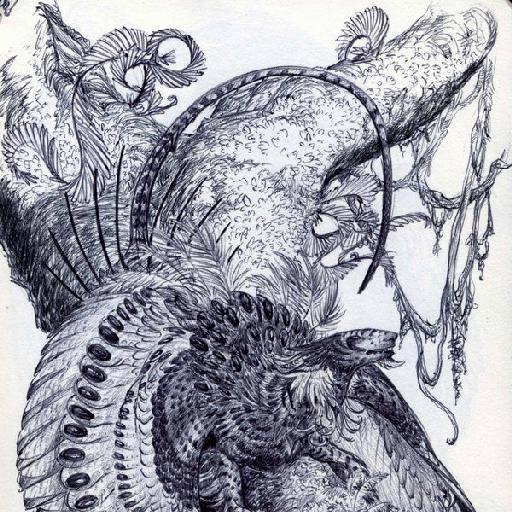
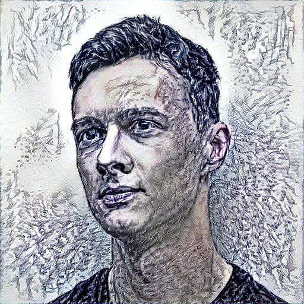
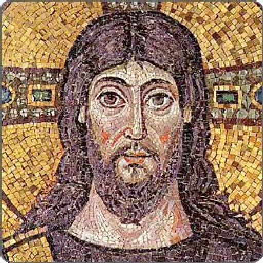
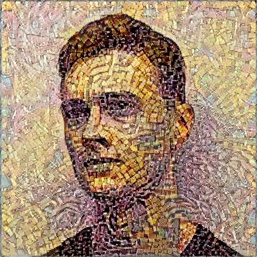
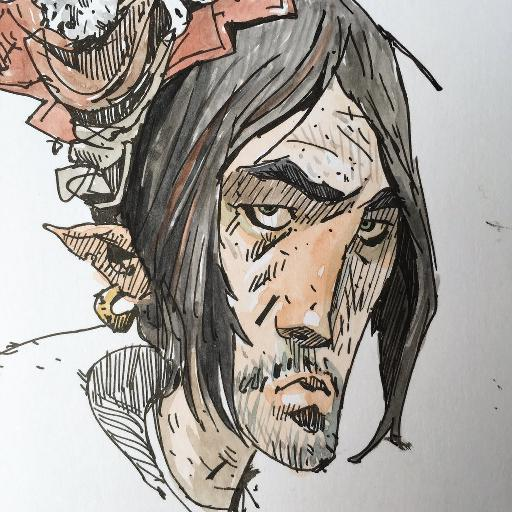
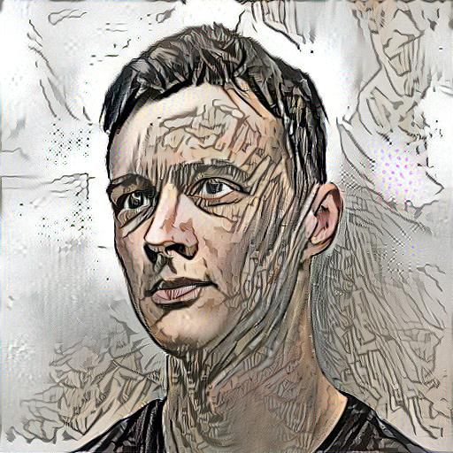
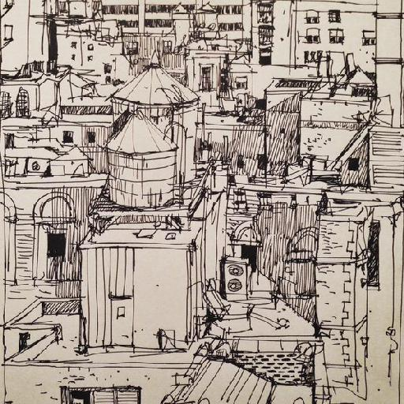
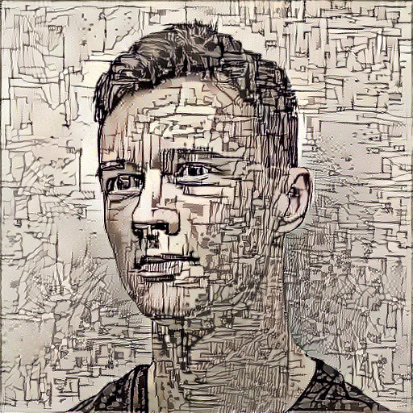
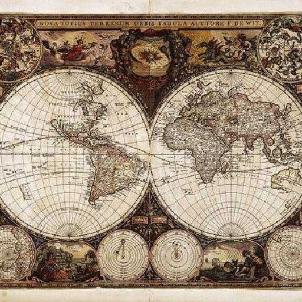
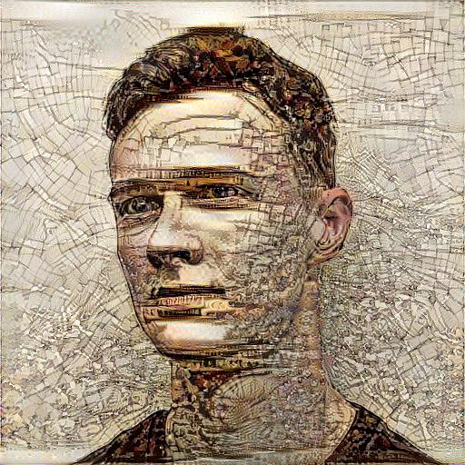

# Artistic-Style

Very simple implementation of Neural Algorithm of the Artistic Style (Gatys <i>et al.</i> - http://arxiv.org/abs/1508.06576) in Tensorflow. 
I used VGG implementation from <a href="https://github.com/machrisaa/tensorflow-vgg">Chris</a> and modified it slightly, stripping away 
unnecessary layers. 

In the examples below I used content image as an initialization, it seems to provide more consistent image, but in the code, you can switch 
easily to noise initialization on line 109 in `style.py`. I used Adam for optimizer and let it run for 500 iterations. 

### To run it, you're going to need:

* Tensorflow
* PIL/Pillow
* This <a href="https://mega.nz/#!xZ8glS6J!MAnE91ND_WyfZ_8mvkuSa2YcA7q-1ehfSm-Q1fxOvvs">npy file</a> from <a href="https://github.com/machrisaa/tensorflow-vgg">Chris</a>

## Usage

```
  python style.py content_image_path style_image_path [output_image] [{top,center,bottom,left,right}] [content_scale] [style_weight]

```
- paths are pretty self-explanatory
- `{top,center,bottom,left,right}` specify how to crop the style image to obtain an image of the same size as the content image
- `content_scale` specifies scale factor that is applied to the input content image. Smaller the image, faster the stylization.
- `style_weight` is a number between 0-1 that specifies emphasis on the style. 0 means no styling, 1 means only styling.

## Examples

First thing I had to do - stylize my very handsome profile picture:

 
 
 
 
 
